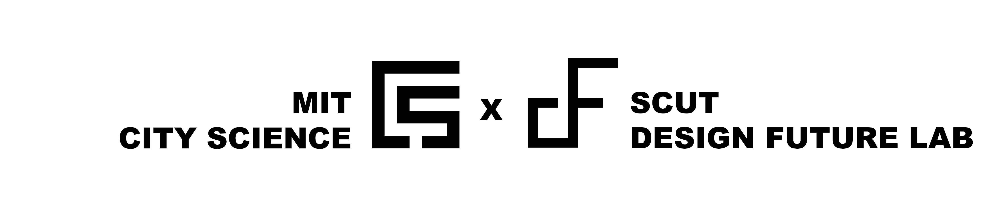

# CityFlow Platform 👋

CityFlow is a low-code, AI-enhanced platform designed to help urban analysts, city planners, and researchers develop, evaluate, and visualize urban solutions with minimal coding effort. By integrating an AI-powered module builder and a collaborative case-based system, CityFlow enables users to create custom workflows, generate code through natural language inputs, and access a growing repository of urban design knowledge. With built-in AI search capabilities, the platform fosters collaboration, making it easier to discover, share, and refine innovative approaches to urban planning and problem-solving.

**[Demo website](https://cityflow.media.mit.edu/)**

## Key Features

### A Low-code Tool for Urban Analyst

CityFlow provides a low-code environment that enables urban analysts to develop and test city models with minimal coding effort.


### An AI Coder for Module Builder

CityFlow incorporates an AI-powered module builder that assists users in coding custom Python and JavaScript modules. Through natural language inputs, the system helps generate and optimize code, making it easier for users to create complex workflows and solutions for urban problems without extensive programming knowledge.


### An Open Platform for Urban Scientists

CityFlow integrates AI-powered search engines into urban workflows, creating a platform that fosters collaboration among experts, city planners, and urban scientists. It enables users to search for and share research findings, workflows, and case studies, contributing to a continuously evolving database of urban design solutions. By facilitating the exchange of knowledge and best practices, CityFlow drives innovation in urban development, making it easier to replicate or adapt successful approaches for more effective city planning and management.


## Quick Start with Docker 🐳

```
docker run -d --name cityflow_platform -p 3000:3000 -v //var/run/docker.sock:/var/run/docker.sock -v ${PWD}/temp:/cityflow_platform/cityflow_executor/code ghcr.io/kekehurry/cityflow_platform:latest
```

Cityflow plaform relies on [cityflow_runner](https://github.com/kekehurry/cityflow_runner.git) to execute python and react modules. The docker container will automatically pull the latest cityflow_runner image. You can also pull it manually before the init process:

```
docker pull ghcr.io/kekehurry/cityflow_runner:latest
```

# Acknowledgement

CityFlow was first conceptualized and developed during my visiting period at MIT. I sincerely thank MIT City Science for their support and inspiration during my work on the CityFlow Platform. I’m also deeply grateful to my supervisor at SCUT Design Future Lab for their guidance and encouragement throughout this journey.



